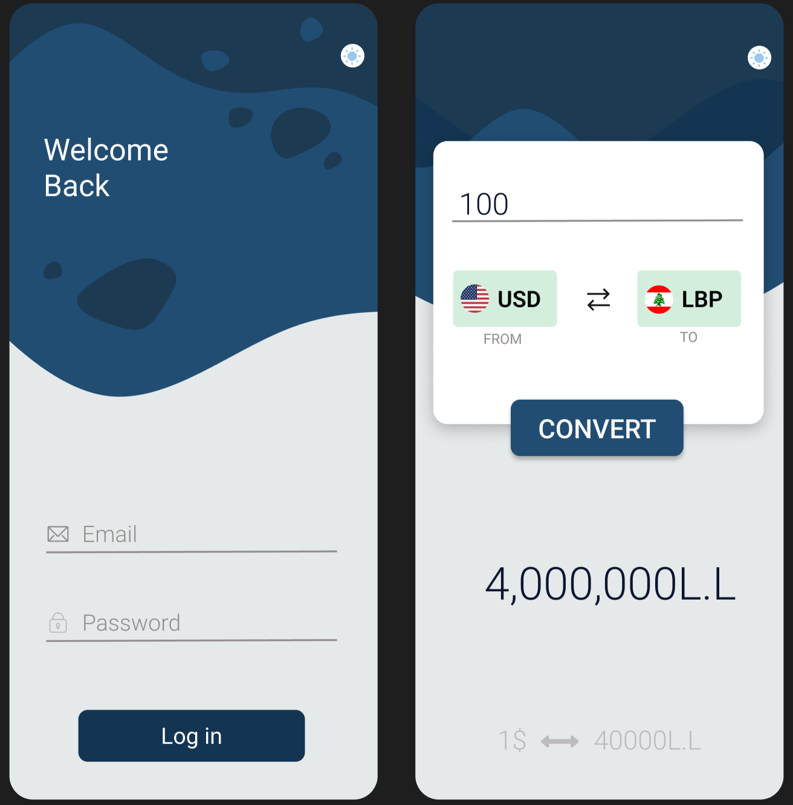
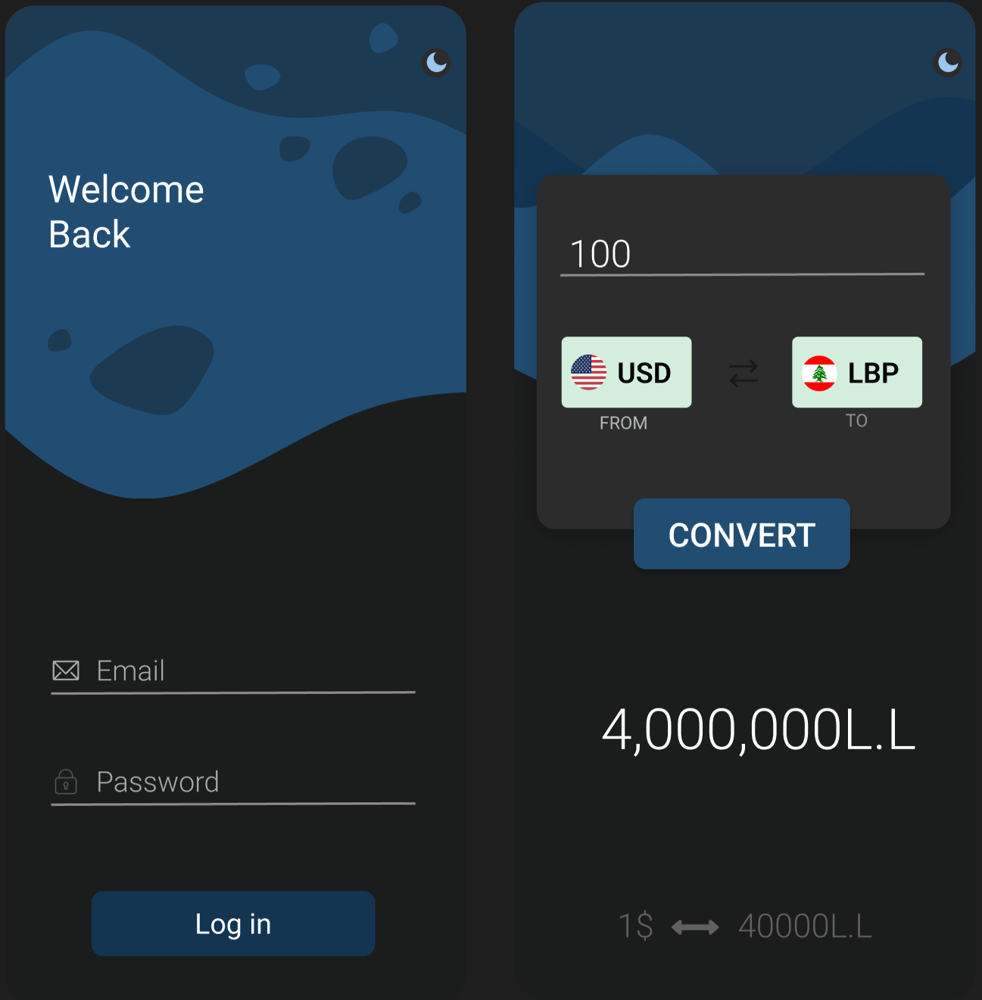

# ConvertPad 🚀
A simple mobile application to convert between two different currencies only.
Available currencies are USD and LBP.

Note that, exchange rate is not following the black market rate, even though i could've used my [LBP RATE API](https://github.com/Murf-y/LBP-DollarRate-API) to get the black market rate, however i had to stick with the assignement requirements.

# Download the app
you can download the app from release section [here](https://github.com/Murf-y/CSC498-Mobile-Computing/releases/tag/v1.0.0)

# Design & Preview
Current application design is present in Design folder, available in the repository. It contains the following:
- Pdf file of the design
- Figma file of the design

<div style="display:flex; gap:5rem">
    </img>
    </img>

</div>

# How to run the app
- Clone the repository 
```
    git clone https://github.com/Murf-y/CSC498-Mobile-Computing.git
```
- Go to ConvertPad folder
 ```
    cd ConvertPad
 ```

- Open the project in Android Studio
- Run the app