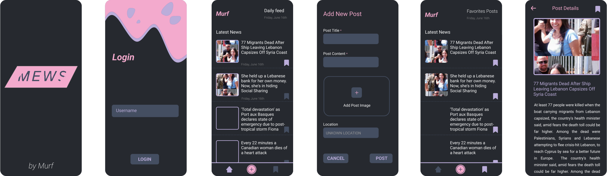

# Mews 🚀

A simple, fast, and secure News app for Android.

Uses a local database to store data, where you can favorite specifc posts so you can read news even when you're offline.


# Download the app
you can download the app from release section [here](https://github.com/Murf-y/CSC498-Mobile-Computing/Mews/build/mews.apk)

# Design & Preview
Current application design is present in Design folder, available in the repository. It contains the following:
- Pdf file of the design
- Figma file of the design



# How to run the app
- Clone the repository 
```
    git clone https://github.com/Murf-y/CSC498-Mobile-Computing.git
```
- Go to Mews folder
 ```
    cd Mews
 ```

- Open the project in Android Studio
- Run the app